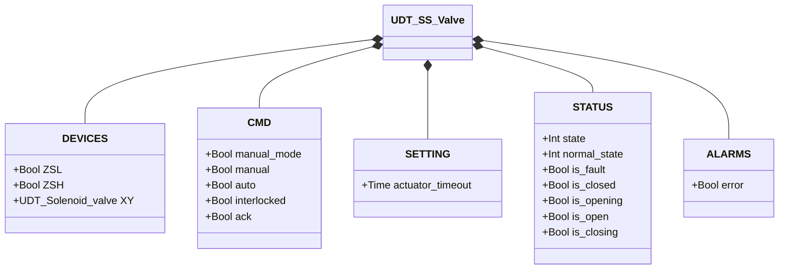
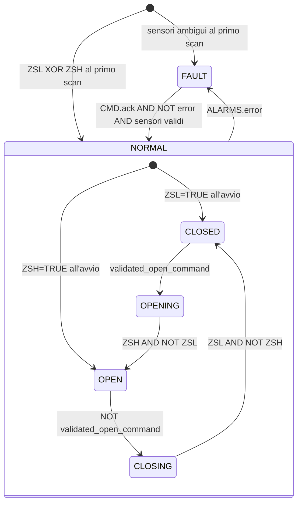

# Valvola a Farfalla — Solenoide Singolo (SS)

## Panoramica

`SS_valve` gestisce una valvola a farfalla pneumatica con singolo solenoide. L'eccitazione di `XY` aziona l'attuatore verso l'apertura; la diseccitazione permette alla molla di riportare il disco in chiusura. Due finecorsa (`ZSL` chiuso, `ZSH` aperto) forniscono il feedback di posizione. La macchina a stati opera su due livelli: uno stato di guasto (`FAULT`) e uno normale (`NORMAL`) con quattro sottostati.

Al primo ciclo PLC, il blocco legge `ZSL` e `ZSH` per determinare lo stato iniziale: ZSL attivo → NORMAL/CLOSED, ZSH attivo → NORMAL/OPEN, condizione ambigua → FAULT.

---

## Componenti principali

- **Attuatore pneumatico** — singolo effetto, ritorno a molla in chiusura
- **Elettrovalvola `XY`** — controlla l'aria all'attuatore: eccitata = apertura o mantenimento aperto
- **Finecorsa `ZSL`** — TRUE = disco completamente chiuso
- **Finecorsa `ZSH`** — TRUE = disco completamente aperto

---

## Segnali I/O

| Segnale | Tipo | Descrizione |
|---------|------|-------------|
| `DEVICES.ZSL` | Bool | INPUT — Finecorsa posizione chiusa |
| `DEVICES.ZSH` | Bool | INPUT — Finecorsa posizione aperta |
| `DEVICES.XY` | UDT_Solenoid_valve | OUTPUT — Elettrovalvola attuatore |
| `CMD.manual_mode` | Bool | COMANDO — TRUE = modalità manuale HMI |
| `CMD.manual` | Bool | COMANDO — Comando apertura in modalità manuale |
| `CMD.auto` | Bool | COMANDO — Comando apertura dall'automazione (ReadOnly external) |
| `CMD.interlocked` | Bool | GUARDIA — TRUE = blocca aggiornamento del comando validato (ReadOnly external) |
| `CMD.ack` | Bool | COMANDO — Conferma allarmi e ripristino da FAULT |
| `SETTING.actuator_timeout` | Time | Timeout movimento attuatore (default T#2s) |
| `STATUS.state` | Int | STATO — 0=FAULT, 1=NORMAL |
| `STATUS.normal_state` | Int | SOTTOSTATO — 1=CLOSED, 2=OPENING, 3=OPEN, 4=CLOSING |
| `STATUS.is_fault` | Bool | STATO — Blocco in condizione di guasto |
| `STATUS.is_closed` | Bool | STATO — Valvola ferma in posizione chiusa |
| `STATUS.is_opening` | Bool | STATO — Attuatore in movimento verso apertura |
| `STATUS.is_open` | Bool | STATO — Valvola completamente aperta |
| `STATUS.is_closing` | Bool | STATO — Molla in rientro verso chiusura |
| `ALARMS.error` | Bool | ALLARME — Uno o più guasti attivi |

---

## Funzionamento

Il blocco risolve il comando desiderato ogni scan:
- Se `manual_mode = TRUE`: `desired_open_command := CMD.manual`
- Altrimenti: `desired_open_command := CMD.auto`

Il comando viene validato solo se `NOT CMD.interlocked`: quando l'interblocco è attivo, `validated_open_command` mantiene l'ultimo valore — la valvola non viene forzata né aperta né chiusa.

**CLOSED** — `XY` diseccitata; molla tiene il disco chiuso. Se `validated_open_command = TRUE`, transizione verso OPENING.

**OPENING** — `XY` eccitata; l'attuatore spinge il disco. Quando `ZSH = TRUE AND ZSL = FALSE`, il disco ha raggiunto la posizione aperta → OPEN. Se il timer `actuator_timeout` scade prima, scatta `movement_timeout`.

**OPEN** — `XY` rimane eccitata per mantenere il disco contro la molla. Se `validated_open_command = FALSE`, transizione verso CLOSING.

**CLOSING** — `XY` diseccitata; la molla riporta il disco. Quando `ZSL = TRUE AND ZSH = FALSE` → CLOSED. Se il timer scade → `movement_timeout`.

Un allarme qualsiasi (`ALARMS.error = TRUE`) porta il blocco in FAULT. `CMD.ack` azzera tutti gli allarmi interni; se le condizioni di guasto sono cessate e i sensori mostrano una posizione valida, il blocco ritorna in NORMAL con lo stato derivato dai finecorsa.

---

## Allarmi

I quattro allarmi interni si sommano in `ALARMS.error`. Tutti si azzerano con `CMD.ack`.

| Allarme | Condizione | Causa tipica |
|---------|------------|--------------|
| `sensor_conflict` | `ZSL = TRUE AND ZSH = TRUE` | Cortocircuito, finecorsa fuori sede |
| `failed_to_close` | NORMAL/CLOSED ma `ZSL = FALSE` | Perdita segnale ZSL, ostruzione meccanica |
| `failed_to_open` | NORMAL/OPEN ma `ZSH = FALSE` | Perdita segnale ZSH, guasto solenoide, assenza aria |
| `movement_timeout` | OPENING o CLOSING oltre `actuator_timeout` | Ostruzione, aria insufficiente, solenoide guasto |

---

## Parametri

| Parametro | Default | Descrizione |
|-----------|---------|-------------|
| `SETTING.actuator_timeout` | T#2s | Tempo massimo ammesso per OPENING e CLOSING prima di generare `movement_timeout` |

---

## Struttura dati

---

## Macchina a stati (FSM)

### Tabella stati e uscite

| Stato | Sottostato | `XY.CMD.auto` | Descrizione |
|-------|------------|---------------|-------------|
| FAULT | — | FALSE | Guasto; attende CMD.ack con sensori validi |
| NORMAL | CLOSED | FALSE | Disco chiuso; molla in posizione |
| NORMAL | OPENING | TRUE | Attuatore spinge il disco verso apertura |
| NORMAL | OPEN | TRUE | Disco aperto; solenoide mantiene contro la molla |
| NORMAL | CLOSING | FALSE | Molla riporta il disco in chiusura |

### Tabella transizioni di stato

| Stato attuale | Condizione | Stato successivo |
|---------------|------------|-----------------|
| NORMAL/CLOSED | `validated_open_command` | NORMAL/OPENING |
| NORMAL/OPENING | `ZSH AND NOT ZSL` | NORMAL/OPEN |
| NORMAL/OPEN | `NOT validated_open_command` | NORMAL/CLOSING |
| NORMAL/CLOSING | `ZSL AND NOT ZSH` | NORMAL/CLOSED |
| NORMAL (qualsiasi) | `ALARMS.error` | FAULT |
| FAULT | `CMD.ack AND NOT error AND ZSL XOR ZSH` | NORMAL/CLOSED o NORMAL/OPEN |
