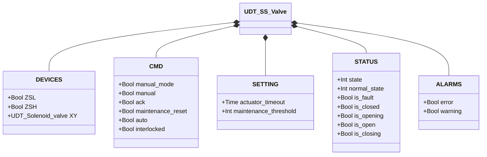
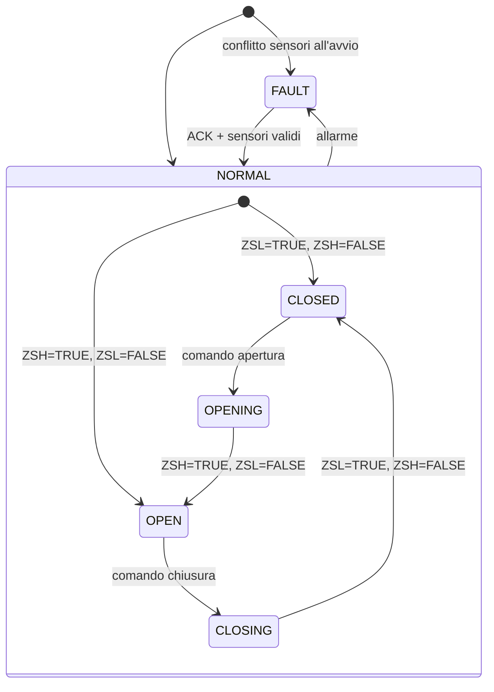

# Valvola a Farfalla — Solenoide Singolo (SS)

## Panoramica

La valvola a farfalla SS è una valvola rotativa pneumatica con singolo solenoide. L'eccitazione di `XY` aziona l'attuatore per aprire il disco; la diseccitazione permette alla molla di chiuderlo. Due finecorsa (`ZSL` chiuso, `ZSH` aperto) forniscono il feedback di posizione. Un contatore di cicli attiva un avviso di manutenzione al raggiungimento della soglia configurata.

---

## Componenti principali

- **Corpo valvola** — flangiato con ingresso/uscita, disco montato su albero
- **Attuatore pneumatico** — singolo effetto, ritorno a molla in chiusura
- **Elettrovalvola `XY`** — controlla l'aria all'attuatore (eccitata = aperta)
- **Finecorsa `ZSL`** — TRUE quando il disco è completamente chiuso
- **Finecorsa `ZSH`** — TRUE quando il disco è completamente aperto

---

## Segnali I/O

| Segnale | Tipo | Descrizione |
|---------|------|-------------|
| `ZSL` | Ingresso — Bool | Finecorsa: TRUE = valvola completamente chiusa |
| `ZSH` | Ingresso — Bool | Finecorsa: TRUE = valvola completamente aperta |
| `XY` | Uscita — Bool | Comando solenoide: TRUE = eccita (apre la valvola) |

---

## Funzionamento

Con un **comando di apertura**, `XY` viene eccitato e l'attuatore ruota il disco verso la posizione aperta. La valvola conferma la posizione aperta quando `ZSH = TRUE` e `ZSL = FALSE`.

Con un **comando di chiusura**, `XY` viene diseccitato e la molla riporta il disco in chiusura. La valvola conferma la posizione chiusa quando `ZSL = TRUE` e `ZSH = FALSE`.

In **modalità manuale** (`manual_mode = TRUE`), l'operatore comanda la valvola dall'HMI tramite `manual`. In **modalità automatica**, il comando arriva dal processo tramite `auto`. Se `interlocked = TRUE`, la valvola mantiene la posizione.

Ogni movimento completato (OPENING→OPEN o CLOSING→CLOSED) incrementa `movement_counter`. Al raggiungimento di `maintenance_threshold`, viene generato `ALARMS.warning`. Si azzera con `maintenance_reset = TRUE`.

Tutti gli errori devono essere confermati tramite `ack`. Dopo la conferma, il blocco funzionale rilegge entrambi i sensori per determinare la posizione effettiva.

---

## Allarmi

| ID | Condizione | Causa |
|----|------------|-------|
| SS-E01 | ZSL = TRUE e ZSH = TRUE simultaneamente | Guasto sensore, disallineamento, cortocircuito |
| SS-E02 | Valvola in stato CLOSED ma ZSL = FALSE | Guasto ZSL, ostruzione meccanica, guasto molla |
| SS-E03 | Valvola in stato OPEN ma ZSH = FALSE | Guasto ZSH, guasto solenoide, assenza aria |
| SS-E04 | Movimento non completato entro `actuator_timeout` | Ostruzione meccanica, guasto solenoide, aria insufficiente |
| SS-W01 | `movement_counter` ≥ `maintenance_threshold` | Intervallo ispezione raggiunto — azzerare con `maintenance_reset` |

---

## Parametri

| Parametro | Default | Descrizione |
|-----------|---------|-------------|
| `actuator_timeout` | T#2s | Tempo massimo per raggiungere la posizione target |
| `maintenance_threshold` | 10000 | Numero di movimenti prima dell'avviso di manutenzione |

---

## Struttura dati

---

## Macchina a stati (FSM)

### Tabella stati e uscite

| Stato | `XY` | `ZSL` atteso | `ZSH` atteso | Descrizione |
|-------|------|-------------|-------------|-------------|
| CLOSED | FALSE | TRUE | FALSE | Disco chiuso, flusso bloccato |
| OPENING | TRUE | (in transizione) | (in transizione) | Attuatore ruota disco verso apertura |
| OPEN | TRUE | FALSE | TRUE | Disco completamente aperto, flusso consentito |
| CLOSING | FALSE | (in transizione) | (in transizione) | Molla riporta il disco in chiusura |
| FAULT | — | — | — | Uscite congelate; richiesta conferma operatore |

### Tabella transizioni di stato

| Stato attuale | Condizione | Stato successivo | Azione |
|---------------|------------|-----------------|--------|
| CLOSED | Comando apertura | OPENING | `XY` → TRUE; avvia timer timeout |
| OPENING | ZSH=TRUE, ZSL=FALSE | OPEN | Ferma timer; incrementa contatore |
| OPENING | Timeout scaduto | FAULT | Genera SS-E04 |
| OPEN | Comando chiusura | CLOSING | `XY` → FALSE; avvia timer timeout |
| CLOSING | ZSL=TRUE, ZSH=FALSE | CLOSED | Ferma timer; incrementa contatore |
| CLOSING | Timeout scaduto | FAULT | Genera SS-E04 |
| CLOSED | ZSL=FALSE | FAULT | Genera SS-E02 |
| OPEN | ZSH=FALSE | FAULT | Genera SS-E03 |
| Qualsiasi | ZSL=TRUE E ZSH=TRUE | FAULT | Genera SS-E01 |
| FAULT | ACK=TRUE, sensori validi | CLOSED o OPEN | Rilegge sensori; azzera allarmi |
