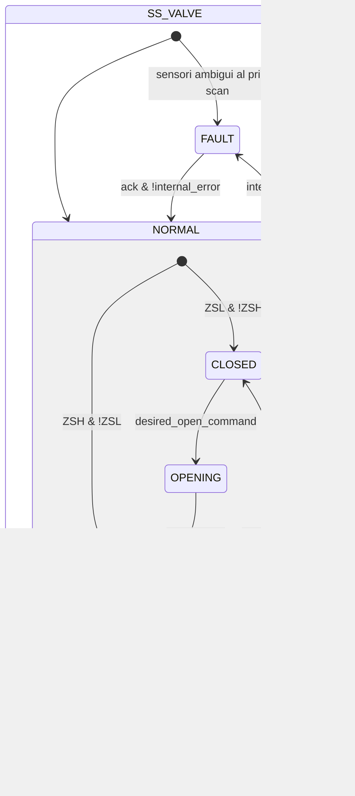
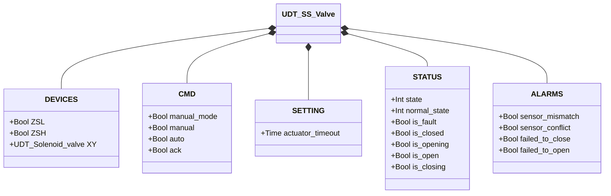

# Valvola a Farfalla — Monosolenoide (SS)

## Panoramica

**Tier 2.** `SS_valve` gestisce una valvola a farfalla pneumatica con singolo solenoide. L'eccitazione di `XY` aziona l'attuatore verso l'apertura; la diseccitazione permette alla molla di riportare il disco in chiusura. Due finecorsa (`ZSL` chiuso, `ZSH` aperto) forniscono il feedback di posizione.

Al primo ciclo PLC, il blocco legge `ZSL` e `ZSH` per determinare lo stato iniziale: `ZSL AND NOT ZSH` → NORMAL/CLOSED, `ZSH AND NOT ZSL` → NORMAL/OPEN, condizione ambigua → FAULT.

---

## Composizione

| Tag | Tipo | Ruolo |
|-----|------|-------|
| `XY` | Valvola a Solenoide (Tier 1) | Attuatore — eccitato durante l'apertura e mantenuto eccitato in OPEN contro la molla |

Arbitraggio manuale/automatico come in [Valvola a Solenoide](../../solenoid/index.it.md).

---

## Segnali di controllo

| Segnale | Tipo | Descrizione |
|---------|------|-------------|
| `DEVICES.ZSL` | Bool | INPUT — Finecorsa posizione chiusa |
| `DEVICES.ZSH` | Bool | INPUT — Finecorsa posizione aperta |
| `DEVICES.XY` | UDT_Solenoid_valve | OUTPUT — Elettrovalvola attuatore |
| `CMD.manual_mode` | Bool | TRUE = modalità manuale HMI |
| `CMD.manual` | Bool | Comando di apertura in modalità manuale |
| `CMD.auto` | Bool | Comando di apertura dall'automazione (ReadOnly external) |
| `CMD.ack` | Bool | Conferma allarmi e ripristino da FAULT |

---

## Parametri di regolazione

| Parametro | Default | Descrizione |
|-----------|---------|-------------|
| `SETTING.actuator_timeout` | T#2s | Tempo massimo ammesso per OPENING e CLOSING |

---

## Stati e output

| Stato | `XY` | Descrizione |
|-------|------|-------------|
| CLOSED | FALSE | Disco chiuso; molla in posizione |
| OPENING | TRUE | Attuatore spinge il disco verso apertura |
| OPEN | TRUE | Disco aperto; solenoide mantiene contro la molla |
| CLOSING | FALSE | Molla riporta il disco in chiusura |
| FAULT | FALSE | Guasto; attende `ack` con sensori validi |

---

## Diagramma di stato



```Pascal
internal_error := sensor_mismatch OR sensor_conflict OR failed_to_close OR failed_to_open;
```

---

## Allarmi

| ID | Condizione specifica |
|----|----------------------|
| [`XV-E01`](../../index.it.md#allarmi-delle-valvole) | Stato stabile corrente non confermato dal finecorsa atteso (`CLOSED` ma `!ZSL`, o `OPEN` ma `!ZSH`) |
| [`XV-E02`](../../index.it.md#allarmi-delle-valvole) | `ZSL AND ZSH` contemporaneamente TRUE |
| [`XV-E03`](../../index.it.md#allarmi-delle-valvole) | `CLOSING` non confermato entro `actuator_timeout` |
| [`XV-E04`](../../index.it.md#allarmi-delle-valvole) | `OPENING` non confermato entro `actuator_timeout` |

---

## Struttura dati



`internal_error` è interno al blocco funzionale, non esposto tramite l'UDT.
