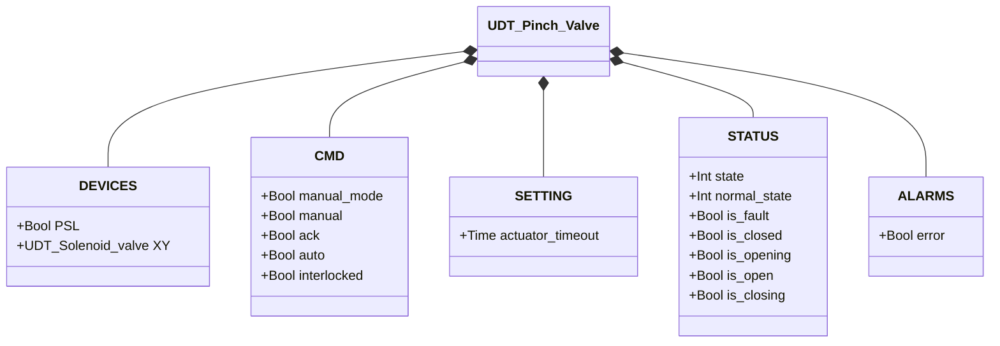
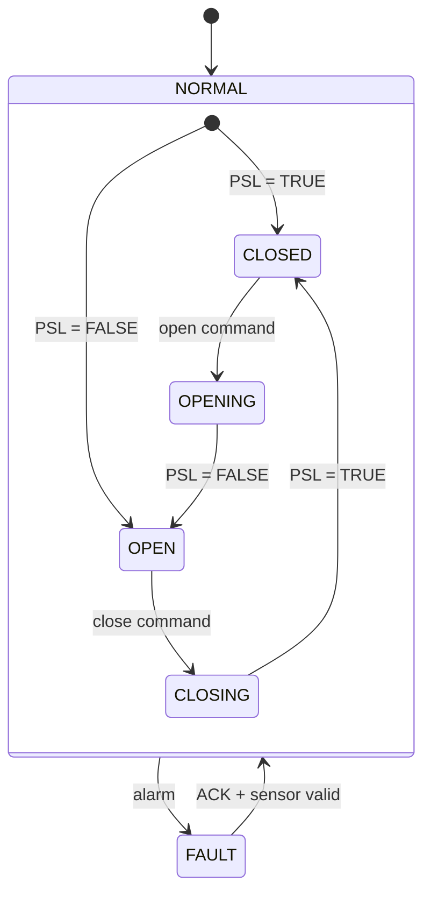

# Pinch Valve

## Overview

The pinch valve controls flow by mechanically compressing a flexible tube. Energizing the solenoid (`XY`) drives the pneumatic actuator to pinch the tube closed; de-energizing releases the tube and restores flow. A pressure switch (`PSL`) confirms the closed position. The valve is normally open — it requires active air pressure to remain closed.

---

## Main Components

- **Flexible tube** — the flow path; compressed to stop flow
- **Pneumatic actuator** — pinching mechanism driven by air pressure
- **Solenoid valve `XY`** — controls air to the actuator (energized = closed)
- **Pressure switch `PSL`** — feedback sensor, TRUE when tube is fully pinched (closed)

---

## I/O Signals

| Signal | Type | Description |
|--------|------|-------------|
| `PSL` | Input — Bool | Pressure switch: TRUE = valve closed (tube pinched) |
| `XY` | Output — Bool | Solenoid command: TRUE = energize actuator (close valve) |

---

## Operating Routine

On a **close command**, `XY` is energized. The actuator pinches the tube until `PSL` becomes TRUE, confirming the closed position.

On an **open command**, `XY` is de-energized. The actuator releases the tube; `PSL` returns to FALSE when fully open.

In **manual mode** (`manual_mode = TRUE`), the operator sets the command directly from the HMI via `manual`. In **automatic mode**, the command comes from the process via `auto`. If `interlocked = TRUE`, the valve ignores movement commands and holds its current position.

All alarms must be acknowledged via `ack`. After acknowledgment, the FB re-reads `PSL` to determine the actual position and resumes normal operation.

---

## Alarms

| ID | Condition | Cause |
|----|-----------|-------|
| PV-E01 | Valve in stable state but `PSL` disagrees | Pressure switch fault, wiring issue, mechanical misalignment, tube wear |
| PV-E02 | Movement did not complete within `actuator_timeout` | Mechanical obstruction, solenoid fault, loss of air supply, tube stuck or damaged |

---

## Settings

| Parameter | Default | Description |
|-----------|---------|-------------|
| `actuator_timeout` | T#2s | Maximum time allowed for the actuator to reach the target position |

---

## Data Structure

---

## State Machine

### State and Output Table

| State | `XY` | `PSL` expected | Description |
|-------|------|---------------|-------------|
| CLOSED | TRUE | TRUE | Tube pinched, flow blocked |
| OPENING | FALSE | (transitioning) | Actuator releasing tube |
| OPEN | FALSE | FALSE | Tube free, flow allowed |
| CLOSING | TRUE | (transitioning) | Actuator pinching tube |
| FAULT | — | — | Outputs frozen; operator ACK required |

### State Transition Table

| Current State | Condition | Next State | Action |
|---------------|-----------|------------|--------|
| CLOSED | open command | OPENING | `XY` → FALSE; start timeout timer |
| OPENING | PSL = FALSE | OPEN | Stop timeout timer |
| OPENING | Timeout elapsed | FAULT | Raise PV-E02 |
| OPEN | close command | CLOSING | `XY` → TRUE; start timeout timer |
| CLOSING | PSL = TRUE | CLOSED | Stop timeout timer |
| CLOSING | Timeout elapsed | FAULT | Raise PV-E02 |
| CLOSED or OPEN | PSL mismatch | FAULT | Raise PV-E01 |
| FAULT | ACK = TRUE, no active alarm | CLOSED or OPEN | Re-read PSL; clear alarms |
