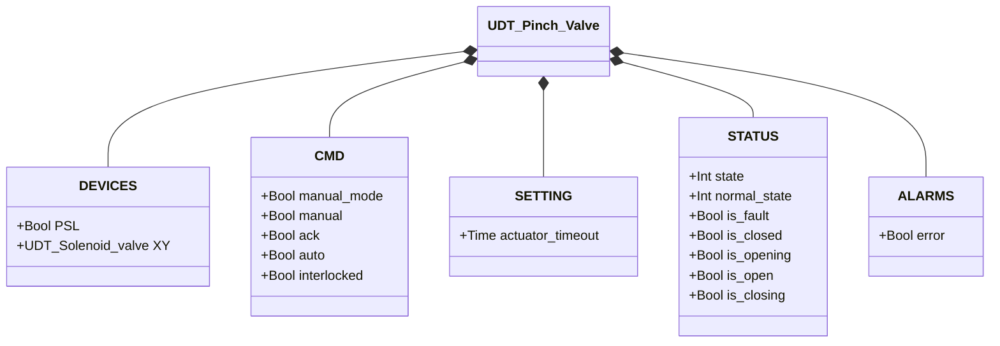
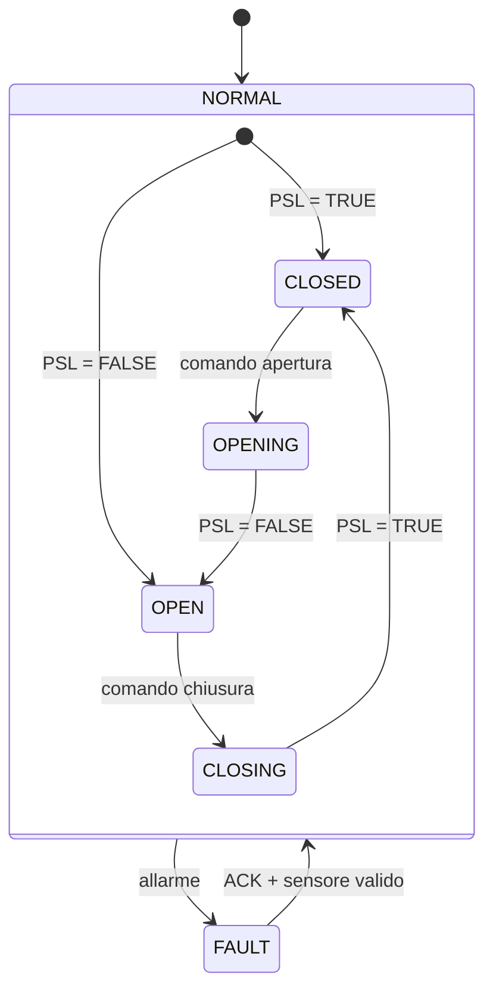

# Valvola a Manicotto

## Panoramica

La valvola a manicotto controlla il flusso comprimendo meccanicamente un tubo flessibile. L'eccitazione del solenoide (`XY`) aziona l'attuatore pneumatico che schiaccia il tubo chiudendolo; la diseccitazione rilascia il tubo ripristinando il flusso. Un pressostato (`PSL`) conferma la posizione chiusa. La valvola è normalmente aperta: richiede pressione d'aria attiva per rimanere chiusa.

---

## Componenti principali

- **Tubo flessibile** — percorso del flusso; compresso per bloccare il passaggio
- **Attuatore pneumatico** — meccanismo di schiacciamento alimentato ad aria compressa
- **Elettrovalvola `XY`** — controlla l'aria verso l'attuatore (eccitata = chiusa)
- **Pressostato `PSL`** — sensore di posizione, TRUE quando il tubo è completamente schiacciato (chiuso)

---

## Segnali I/O

| Segnale | Tipo | Descrizione |
|---------|------|-------------|
| `PSL` | Ingresso — Bool | Pressostato: TRUE = valvola chiusa (tubo schiacciato) |
| `XY` | Uscita — Bool | Comando solenoide: TRUE = eccita l'attuatore (chiude la valvola) |

---

## Funzionamento

Con un **comando di chiusura**, `XY` viene eccitato. L'attuatore schiaccia il tubo fino a quando `PSL` diventa TRUE, confermando la posizione chiusa.

Con un **comando di apertura**, `XY` viene diseccitato. L'attuatore rilascia il tubo; `PSL` torna a FALSE quando la valvola è completamente aperta.

In **modalità manuale** (`manual_mode = TRUE`), l'operatore imposta il comando direttamente dall'HMI tramite `manual`. In **modalità automatica**, il comando arriva dal processo tramite `auto`. Se `interlocked = TRUE`, la valvola ignora i comandi di movimento e mantiene la posizione corrente.

Tutti gli allarmi devono essere confermati tramite `ack`. Dopo la conferma, il blocco funzionale rilegge `PSL` per determinare la posizione effettiva e riprende il funzionamento normale.

---

## Allarmi

| ID | Condizione | Causa |
|----|------------|-------|
| PV-E01 | Valvola in stato stabile ma `PSL` non concorda | Guasto al pressostato, problema di cablaggio, disallineamento meccanico, usura del tubo |
| PV-E02 | Il movimento non si è completato entro `actuator_timeout` | Ostruzione meccanica, guasto al solenoide, perdita di alimentazione aria, tubo bloccato o danneggiato |

---

## Parametri

| Parametro | Default | Descrizione |
|-----------|---------|-------------|
| `actuator_timeout` | T#2s | Tempo massimo consentito all'attuatore per raggiungere la posizione target |

---

## Struttura dati

---

## Macchina a stati (FSM)

### Tabella stati e uscite

| Stato | `XY` | `PSL` atteso | Descrizione |
|-------|------|-------------|-------------|
| CLOSED | TRUE | TRUE | Tubo schiacciato, flusso bloccato |
| OPENING | FALSE | (in transizione) | Attuatore rilascia il tubo |
| OPEN | FALSE | FALSE | Tubo libero, flusso consentito |
| CLOSING | TRUE | (in transizione) | Attuatore schiaccia il tubo |
| FAULT | — | — | Uscite congelate; richiesta conferma operatore |

### Tabella transizioni di stato

| Stato attuale | Condizione | Stato successivo | Azione |
|---------------|------------|-----------------|--------|
| CLOSED | Comando apertura | OPENING | `XY` → FALSE; avvia timer timeout |
| OPENING | PSL = FALSE | OPEN | Ferma timer timeout |
| OPENING | Timeout scaduto | FAULT | Genera allarme PV-E02 |
| OPEN | Comando chiusura | CLOSING | `XY` → TRUE; avvia timer timeout |
| CLOSING | PSL = TRUE | CLOSED | Ferma timer timeout |
| CLOSING | Timeout scaduto | FAULT | Genera allarme PV-E02 |
| CLOSED o OPEN | PSL non concorda | FAULT | Genera allarme PV-E01 |
| FAULT | ACK = TRUE, nessun allarme attivo | CLOSED o OPEN | Rilegge PSL; azzera allarmi |
