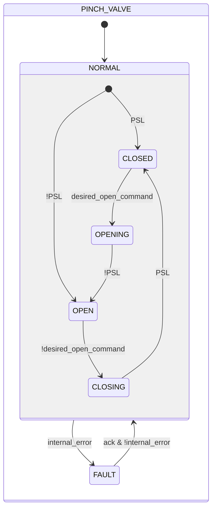
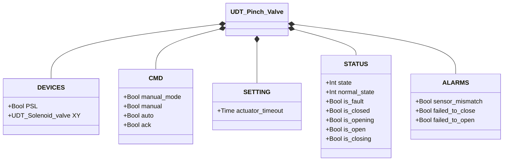

# Valvola a Manicotto

## Panoramica

**Tier 2.** La valvola a manicotto controlla il flusso comprimendo meccanicamente un tubo flessibile. L'eccitazione del solenoide interno (`XY`) aziona l'attuatore pneumatico che schiaccia il tubo chiudendolo; la diseccitazione rilascia il tubo ripristinando il flusso. Un pressostato (`PSL`) conferma la posizione chiusa — è l'unico sensore di posizione del dispositivo. La valvola è normalmente aperta: richiede eccitazione attiva per rimanere chiusa.

---

## Composizione

| Tag | Tipo | Ruolo |
|-----|------|-------|
| `XY` | Valvola a Solenoide (Tier 1) | Attuatore — eccitato = chiuso |

L'arbitraggio manuale/automatico (`manual_mode`/`manual`/`auto`) segue lo stesso schema descritto in [Valvola a Solenoide](../solenoid/index.it.md).

---

## Segnali di controllo

| Segnale | Tipo | Descrizione |
|---------|------|-------------|
| `DEVICES.PSL` | Bool | INPUT — Pressostato: TRUE = valvola chiusa (tubo schiacciato) |
| `DEVICES.XY` | UDT_Solenoid_valve | OUTPUT — Elettrovalvola attuatore |
| `CMD.manual_mode` | Bool | TRUE = modalità manuale HMI |
| `CMD.manual` | Bool | Comando di chiusura in modalità manuale |
| `CMD.auto` | Bool | Comando di chiusura dall'automazione (ReadOnly external) |
| `CMD.ack` | Bool | Conferma allarmi e ripristino da FAULT |

---

## Parametri di regolazione

| Parametro | Default | Descrizione |
|-----------|---------|-------------|
| `SETTING.actuator_timeout` | T#2s | Tempo massimo consentito per completare una manovra di apertura o chiusura |

---

## Stati e output

| Stato | `XY` | `PSL` atteso | Descrizione |
|-------|------|-------------|-------------|
| CLOSED | TRUE | TRUE | Tubo schiacciato, flusso bloccato |
| OPENING | FALSE | (in transizione) | Attuatore rilascia il tubo |
| OPEN | FALSE | FALSE | Tubo libero, flusso consentito |
| CLOSING | TRUE | (in transizione) | Attuatore schiaccia il tubo |
| FAULT | — | — | Uscite congelate; richiede conferma operatore |

---

## Diagramma di stato



```Pascal
internal_error := sensor_mismatch OR failed_to_close OR failed_to_open;
```

Al rientro da `FAULT`, il blocco rilegge `PSL` per determinare lo stato stabile (`CLOSED` se TRUE, altrimenti `OPEN`) — stesso meccanismo del primo scan.

---

## Allarmi

| ID | Condizione specifica |
|----|----------------------|
| [`XV-E01`](../index.it.md#allarmi-delle-valvole) | Stato stabile corrente (CLOSED/OPEN) non confermato da `PSL` |
| [`XV-E03`](../index.it.md#allarmi-delle-valvole) | `CLOSING` non confermato entro `actuator_timeout` |
| [`XV-E04`](../index.it.md#allarmi-delle-valvole) | `OPENING` non confermato entro `actuator_timeout` |

Non applicabile: `XV-E02` (conflitto sensori) — il Manicotto ha un solo sensore di posizione.

---

## Struttura dati



`internal_error` è interno al blocco funzionale, non esposto tramite l'UDT.
