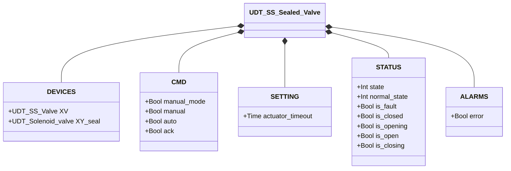
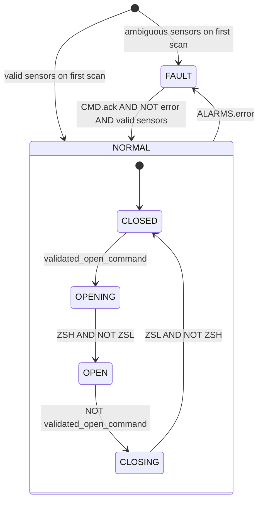

# Sealed Single-Solenoid Butterfly Valve (SS Sealed)

## Overview

`SS_Sealed_valve` wraps `SS_valve` with an additional seal solenoid (`XY_seal`). The seal is energised automatically whenever the valve is in the CLOSED position, ensuring pneumatic sealing at rest. When the valve opens, the seal is de-energised.

All opening/closing logic and alarm detection is delegated to the internal `SS_valve` instance. The wrapper exposes the same states and alarms via `STATUS` and `ALARMS.error`.

---

## Main Components

- **Internal valve `XV`** (`UDT_SS_Valve`) — SS butterfly valve managed by an internal `SS_valve` instance; see [SS Butterfly Valve](../../butterfly/single_solenoid/index.en.md)
- **Seal solenoid `XY_seal`** (`UDT_Solenoid_valve`) — energised when `XV` is CLOSED; provides sealing during the resting state

---

## I/O Signals

| Signal | Type | Description |
|--------|------|-------------|
| `DEVICES.XV` | UDT_SS_Valve | Internal SS butterfly valve |
| `DEVICES.XY_seal` | UDT_Solenoid_valve | Seal solenoid: energised ↔ valve CLOSED |
| `CMD.manual_mode` | Bool | COMMAND — TRUE = HMI manual mode |
| `CMD.manual` | Bool | COMMAND — Manual open command |
| `CMD.auto` | Bool | COMMAND — Automatic open command (ReadOnly external) |
| `CMD.ack` | Bool | COMMAND — Acknowledge alarms |
| `SETTING.actuator_timeout` | Time | Actuator timeout propagated to `XV` (default T#2s) |
| `STATUS.state` | Int | STATE — 0=FAULT, 1=NORMAL (mirror of XV.STATUS.state) |
| `STATUS.normal_state` | Int | SUB-STATE — 1=CLOSED, 2=OPENING, 3=OPEN, 4=CLOSING |
| `STATUS.is_fault` | Bool | STATE — Fault |
| `STATUS.is_closed` | Bool | STATE — Valve closed and sealed |
| `STATUS.is_opening` | Bool | STATE — Opening |
| `STATUS.is_open` | Bool | STATE — Open |
| `STATUS.is_closing` | Bool | STATE — Closing |
| `ALARMS.error` | Bool | ALARM — Mirror of XV.ALARMS.error |

---

## Operating Routine

The wrapper resolves the desired command and writes it to `XV.CMD.auto`:
- If `manual_mode = TRUE`: `XV.CMD.auto := CMD.manual`
- Otherwise: `XV.CMD.auto := CMD.auto`

The internal `SS_valve` block executes the full FSM logic and handles movement timeout.

The seal is controlled by a single rule:

```
XY_seal.CMD.auto := XV.STATUS.is_closed
```

When the valve is confirmed closed (`is_closed = TRUE`), the seal engages. As soon as the valve begins to open (transition to OPENING), `is_closed` falls to FALSE and the seal releases.

`STATUS` and `ALARMS.error` are direct copies of the corresponding `XV` fields.

---

## Alarms

Alarms originate from the internal `SS_valve` instance. See [SS Valve alarms](../../butterfly/single_solenoid/index.en.md#alarms).

| Alarm | Condition |
|-------|-----------|
| `ALARMS.error` | Mirror of `XV.ALARMS.error` — sensor_conflict, failed_to_close, failed_to_open, movement_timeout |

---

## Settings

| Parameter | Default | Description |
|-----------|---------|-------------|
| `SETTING.actuator_timeout` | T#2s | Propagated to `XV.SETTING.actuator_timeout` every scan |

---

## Data Structure



---

## State Machine (FSM)

The FSM is fully managed by the internal `SS_valve` instance. The wrapper adds only the seal logic.



### Seal Logic

| XV State | `XY_seal.CMD.auto` |
|----------|-------------------|
| CLOSED | TRUE (sealed) |
| OPENING / OPEN / CLOSING | FALSE (released) |
| FAULT | FALSE |
