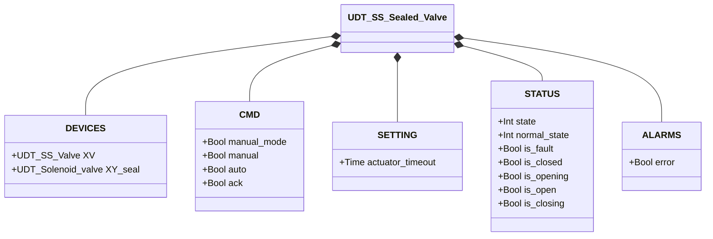
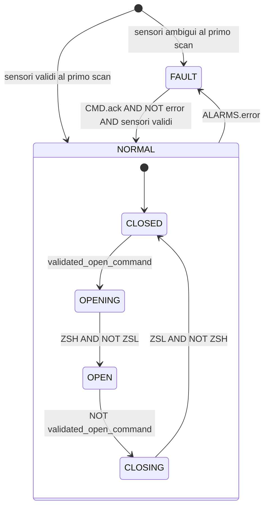

# Valvola Sigillata — Solenoide Singolo (SS Sealed)

## Panoramica

`SS_Sealed_valve` è un wrapper attorno a `SS_valve` che aggiunge un solenoide di sigillo (`XY_seal`). Il sigillo viene eccitato automaticamente quando la valvola è in posizione CLOSED, garantendo tenuta pneumatica in stato di riposo. Quando la valvola si apre, il sigillo viene diseccitato.

Il blocco delega tutta la logica di apertura/chiusura e il rilevamento degli allarmi all'istanza interna `SS_valve`, esponendo gli stessi stati e allarmi tramite `STATUS` e `ALARMS.error`.

---

## Componenti principali

- **Valvola interna `XV`** (`UDT_SS_Valve`) — valvola a farfalla SS gestita da un'istanza interna `SS_valve`; vedere [Valvola a Farfalla SS](../../butterfly/single_solenoid/index.it.md)
- **Solenoide di sigillo `XY_seal`** (`UDT_Solenoid_valve`) — eccitato quando `XV` è in CLOSED; garantisce tenuta durante la fase di riposo

---

## Segnali I/O

| Segnale | Tipo | Descrizione |
|---------|------|-------------|
| `DEVICES.XV` | UDT_SS_Valve | Valvola a farfalla SS interna |
| `DEVICES.XY_seal` | UDT_Solenoid_valve | Solenoide di sigillo: eccitato ↔ valvola CLOSED |
| `CMD.manual_mode` | Bool | COMANDO — TRUE = modalità manuale HMI |
| `CMD.manual` | Bool | COMANDO — Apertura manuale |
| `CMD.auto` | Bool | COMANDO — Apertura automatica (ReadOnly external) |
| `CMD.ack` | Bool | COMANDO — Conferma allarmi |
| `SETTING.actuator_timeout` | Time | Timeout attuatore propagato a `XV` (default T#2s) |
| `STATUS.state` | Int | STATO — 0=FAULT, 1=NORMAL (mirror di XV.STATUS.state) |
| `STATUS.normal_state` | Int | SOTTOSTATO — 1=CLOSED, 2=OPENING, 3=OPEN, 4=CLOSING |
| `STATUS.is_fault` | Bool | STATO — Guasto |
| `STATUS.is_closed` | Bool | STATO — Valvola chiusa e sigillata |
| `STATUS.is_opening` | Bool | STATO — In apertura |
| `STATUS.is_open` | Bool | STATO — Aperta |
| `STATUS.is_closing` | Bool | STATO — In chiusura |
| `ALARMS.error` | Bool | ALLARME — Mirror di XV.ALARMS.error |

---

## Funzionamento

Il comando desiderato viene risolto dal wrapper e scritto in `XV.CMD.auto`:
- Se `manual_mode = TRUE`: `XV.CMD.auto := CMD.manual`
- Altrimenti: `XV.CMD.auto := CMD.auto`

Il blocco interno `SS_valve` esegue l'intera logica FSM e gestisce il timeout del movimento.

Il sigillo è controllato da una singola regola:

```
XY_seal.CMD.auto := XV.STATUS.is_closed
```

Quando la valvola è confermata chiusa (`is_closed = TRUE`), il sigillo viene eccitato. Appena la valvola inizia ad aprirsi (transizione a OPENING), `is_closed` cade a FALSE e il sigillo si diseccita.

`STATUS` e `ALARMS.error` sono copie dirette dei campi corrispondenti di `XV`.

---

## Allarmi

Gli allarmi provengono dall'istanza interna `SS_valve`. Vedere [allarmi Valvola SS](../../butterfly/single_solenoid/index.it.md#allarmi).

| Allarme | Condizione |
|---------|------------|
| `ALARMS.error` | Mirror di `XV.ALARMS.error` — sensor_conflict, failed_to_close, failed_to_open, movement_timeout |

---

## Parametri

| Parametro | Default | Descrizione |
|-----------|---------|-------------|
| `SETTING.actuator_timeout` | T#2s | Propagato a `XV.SETTING.actuator_timeout` ad ogni scan |

---

## Struttura dati



---

## Macchina a stati (FSM)

La FSM è interamente gestita dall'istanza interna `SS_valve`. Il wrapper aggiunge solo la logica del sigillo.



### Logica sigillo

| Stato XV | `XY_seal.CMD.auto` |
|----------|-------------------|
| CLOSED | TRUE (sigillato) |
| OPENING / OPEN / CLOSING | FALSE (aperto) |
| FAULT | FALSE |
