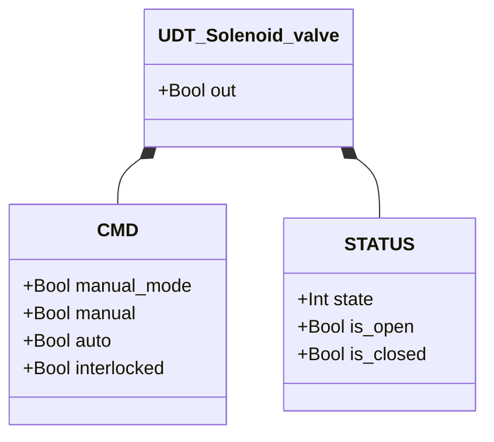
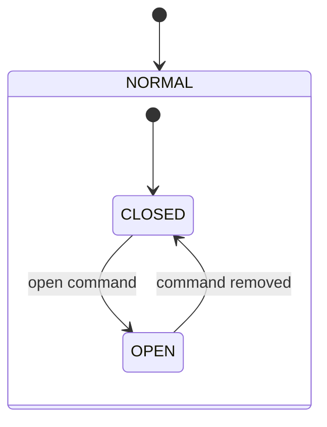

# Solenoid Valve

## Overview

The solenoid valve is a directly controlled on/off valve. An electromagnetic coil drives a plunger to open or close the valve port. There is no position feedback — the valve state is assumed from the command. It is the base actuator used as a sub-component inside other library modules.

---

## Main Components

- **Valve body** — inlet and outlet ports
- **Electromagnetic coil** — moves the plunger on energization
- **Plunger / poppet** — seals or opens the port
- **Spring return** — returns plunger to rest position when de-energized

---

## I/O Signals

| Signal | Type | Description |
|--------|------|-------------|
| `out` | Output — Bool | Physical coil command: TRUE = energized (open) |

---

## Operating Routine

When commanded open (`auto = TRUE` or `manual = TRUE` in manual mode), the coil is energized and the valve opens. When the command is removed, the spring returns the plunger and the valve closes.

If `interlocked = TRUE`, the validated command freezes at its last value — the valve neither opens nor closes until the interlock is released. There is no `ack` on this module as there are no alarms.

---

## Alarms

No alarms — no position feedback available.

---

## Settings

No configurable settings.

---

## Data Structure

---

## State Machine

### State and Output Table

| State | `out` | Description |
|-------|-------|-------------|
| CLOSED (1) | FALSE | Valve closed, no flow |
| OPEN (3) | TRUE | Valve open, flow permitted |

### State Transition Table

| Current State | Condition | Next State | Action |
|---------------|-----------|------------|--------|
| CLOSED | validated_open_command = TRUE | OPEN | `out` → TRUE |
| OPEN | validated_open_command = FALSE | CLOSED | `out` → FALSE |
