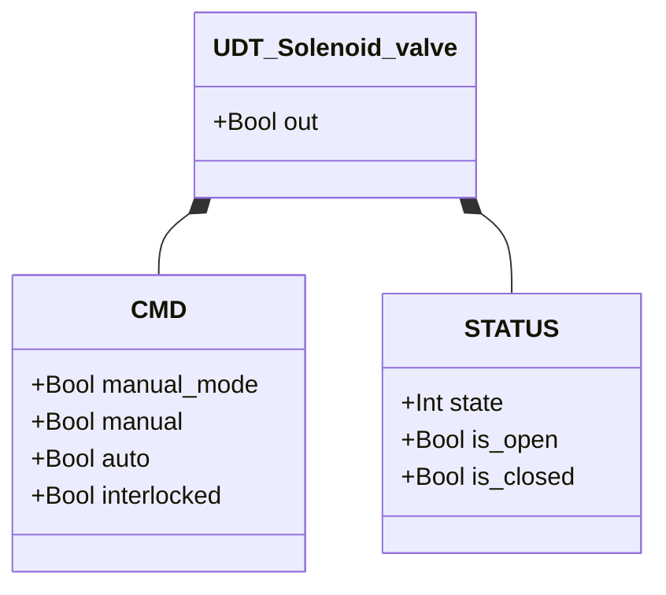
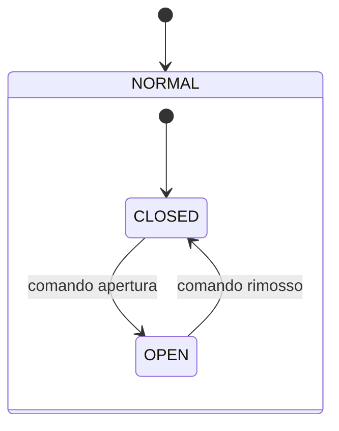

# Valvola a Solenoide

## Panoramica

La valvola a solenoide è una valvola on/off a controllo diretto. Una bobina elettromagnetica aziona uno stantuffo per aprire o chiudere la porta della valvola. Non è presente alcun sensore di posizione — lo stato è desunto dal comando. È l'attuatore base usato come sotto-componente in altri moduli della libreria.

---

## Componenti principali

- **Corpo valvola** — porte di ingresso e uscita
- **Bobina elettromagnetica** — muove lo stantuffo all'eccitazione
- **Stantuffo / otturatore** — chiude o apre la porta
- **Ritorno a molla** — riporta lo stantuffo in posizione di riposo alla diseccitazione

---

## Segnali I/O

| Segnale | Tipo | Descrizione |
|---------|------|-------------|
| `out` | Uscita — Bool | Comando fisico bobina: TRUE = eccitata (aperta) |

---

## Funzionamento

Quando il comando di apertura è attivo (`auto = TRUE` o `manual = TRUE` in modalità manuale), la bobina viene eccitata e la valvola si apre. Quando il comando viene rimosso, la molla riporta lo stantuffo e la valvola si chiude.

Se `interlocked = TRUE`, il comando validato si blocca all'ultimo valore — la valvola non apre né chiude finché l'interlock non viene rimosso. Non è presente `ack` su questo modulo in quanto non ci sono allarmi.

---

## Allarmi

Nessun allarme — nessun sensore di posizione disponibile.

---

## Parametri

Nessun parametro configurabile.

---

## Struttura dati

---

## Macchina a stati (FSM)

### Tabella stati e uscite

| Stato | `out` | Descrizione |
|-------|-------|-------------|
| CLOSED (1) | FALSE | Valvola chiusa, nessun flusso |
| OPEN (3) | TRUE | Valvola aperta, flusso consentito |

### Tabella transizioni di stato

| Stato attuale | Condizione | Stato successivo | Azione |
|---------------|------------|-----------------|--------|
| CLOSED | validated_open_command = TRUE | OPEN | `out` → TRUE |
| OPEN | validated_open_command = FALSE | CLOSED | `out` → FALSE |
